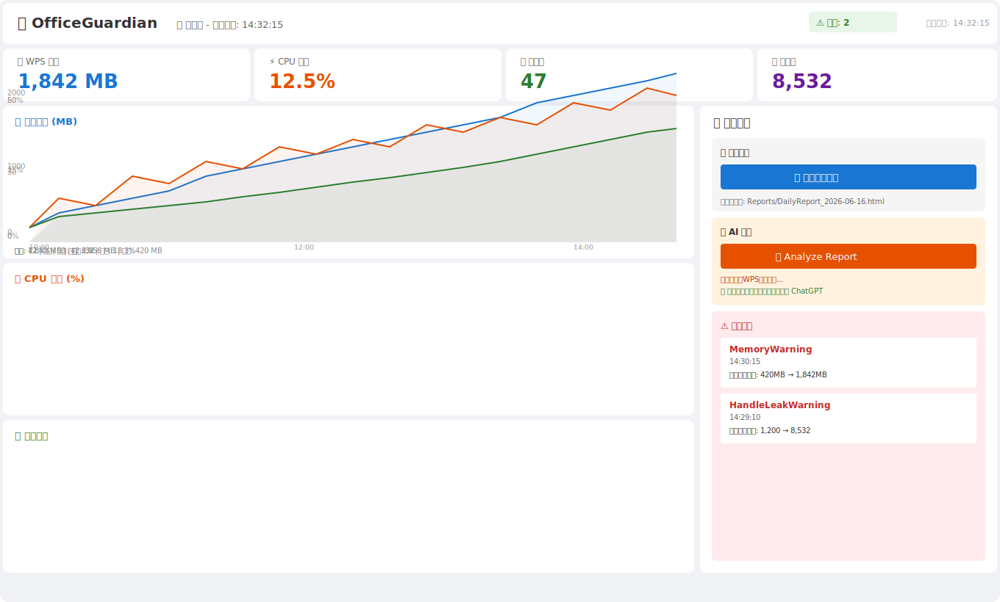

# 🛡️ OfficeGuardian

WPS 运行状态监控工具 — 长期监控 WPS Office 进程，检测内存泄漏、CPU 异常占用、句柄增长等资源问题，并生成分析报告。


---

## 📋 功能总览

| 阶段 | 功能 | 说明 |
|------|------|------|
| 1 | **项目框架** | .NET 8 + WPF + MVVM + DI + SQLite |
| 2 | **进程扫描** | 配置文件驱动，可监控任意 Windows 进程 |
| 3 | **CPU 统计** | 双采样跨核心 CPU 占用率计算 |
| 4 | **异常检测** | 内存泄漏 / 线程暴涨 / 句柄泄漏智能判定 |
| 5 | **仪表盘** | LiveCharts2 实时趋势图（内存/CPU/线程） |
| 6 | **自动报告** | 每日 HTML 日报，含最高/平均内存CPU + 告警列表 |
| 7 | **AI 分析** | 导出 JSON 结构化数据 + 分析提示词，一键粘贴给 ChatGPT |
| 8 | **自动提醒** | 内存 >3000MB 弹窗告警，建议保存文件重启 |

---

## 🔧 配置驱动 — 想监控什么就监控什么

不再把进程名写死在代码里。所有要监控的目标进程通过 `appsettings.json` 配置：

```json
{
  "WatchProcesses": [
    "wps",
    "et",
    "wpp",
    "wpspdf",
    "wpscloudsvr",
    "wpscenter",
    "wpsservice"
  ]
}
```

想监控别的软件？改配置文件就行：

```json
{
  "WatchProcesses": [
    "acad",       // AutoCAD
    "WeChat",     // 微信
    "chrome",     // Chrome 浏览器
    "explorer"    // 资源管理器
  ]
}
```

> 修改后重启程序即可生效，无需重新编译。

---

## 🚀 快速开始

### 方式一：下载发布包（推荐，无需环境）

1. 从 [Releases](https://github.com/a641523451-hue/OfficeGuardian/releases) 下载最新版 `OfficeGuardian-v1.0.zip`（约40MB）
2. 解压到任意目录
3. 右键 `install.ps1` → **使用 PowerShell 运行**
4. 安装完成自动创建桌面和开始菜单快捷方式

> 无需安装 .NET 运行时，已通过 `--self-contained` 打包
> 支持 Windows 10 / Windows 11 (64位)

### 方式二：从源码运行

```bash
git clone https://github.com/a641523451-hue/OfficeGuardian.git
cd OfficeGuardian
dotnet run --project src
```

**前置条件**：
- [.NET 8 SDK](https://dotnet.microsoft.com/download/dotnet/8.0)
- Windows 10 / Windows 11

---

## 📁 项目结构

```
src/
├── OfficeGuardian.csproj         # 项目文件
├── appsettings.json              # 配置文件（要监控的进程列表）
├── App.xaml / App.xaml.cs        # DI 容器 + 启动入口
├── Data/
│   └── DatabaseContext.cs        # SQLite 数据库操作
├── Models/
│   └── ProcessLog.cs             # 进程日志 + 告警模型
├── Services/
│   ├── ProcessMonitorService.cs  # 进程扫描（每60秒，配置驱动）
│   ├── CpuUsageCalculator.cs     # CPU 占用率计算
│   ├── LeakDetector.cs           # 内存/线程/句柄泄漏检测
│   ├── ReportService.cs          # HTML 报告 + AI 数据导出
│   └── AlertService.cs           # 弹窗告警
├── ViewModels/
│   ├── RelayCommand.cs           # MVVM 命令基类
│   └── DashboardViewModel.cs     # 仪表盘视图模型
├── Views/
│   ├── MainWindow.xaml           # 仪表盘 UI
│   └── MainWindow.xaml.cs        # 窗口代码
├── docs/
│   └── dashboard.svg             # 界面预览图
├── README.md
├── .gitignore
└── .gitattributes
```

---

## 🖥️ 界面预览



---

## ⚙️ 异常检测规则

| 检测类型 | 触发条件 | 阈值 |
|----------|----------|------|
| **内存泄漏警告** | 4小时内内存持续增长 | 增长 > 500MB |
| **线程暴涨警告** | 线程数异常增长 | 增长 > 30% |
| **句柄泄漏警告** | 句柄数持续增长，4小时无回落 | 单调递增 |
| **自动弹窗提醒** | 单进程内存超过阈值 | > 3000MB |

---

## 🤖 AI 分析

点击 **Analyze Report** 按钮后，工具会自动导出如下格式的 JSON 数据：

```json
{
  "Process": "wps.exe",
  "MemoryStart": 420,
  "MemoryEnd": 3812,
  "CpuAvg": 18.3,
  "HandlesStart": 1200,
  "HandlesEnd": 9500
}
```

同时生成分析提示词，可直接粘贴到 ChatGPT 或 Codex：

> 请分析以下WPS监控数据，判断：
> 1. 是否存在内存泄漏
> 2. 是否存在句柄泄漏
> 3. 是否存在CPU异常
> 4. 给出优化建议

---

## 📊 每日报告示例

生成的 HTML 日报内容：

```
2026-06-16
WPS.exe
最高内存: 3812 MB
平均内存: 1640 MB
CPU峰值: 42%
平均CPU: 18.3%
异常: Memory Leak Warning
```

---

## 🛠️ 技术栈

- [.NET 8](https://dotnet.microsoft.com/download/dotnet/8.0) — 框架基础
- [WPF](https://docs.microsoft.com/dotnet/desktop/wpf/) — 桌面 UI
- [MVVM](https://docs.microsoft.com/dotnet/desktop/wpf/mvvm/) — 架构模式
- [Microsoft.Extensions.DependencyInjection](https://docs.microsoft.com/dotnet/core/extensions/dependency-injection) — DI 容器
- [Microsoft.Extensions.Configuration.Json](https://docs.microsoft.com/dotnet/core/extensions/configuration) — JSON 配置
- [Microsoft.Data.Sqlite](https://docs.microsoft.com/dotnet/standard/data/sqlite/) — 本地数据库
- [LiveCharts2](https://livecharts.dev/) — 实时图表
- [SkiaSharp](https://skia-sharp.github.io/SkiaSharp/) — 跨平台 2D 渲染

---

## 📄 许可证

本项目仅供学习参考。

---

## 📬 联系方式

如有问题或建议，请提交 [Issue](https://github.com/a641523451-hue/OfficeGuardian/issues)。

